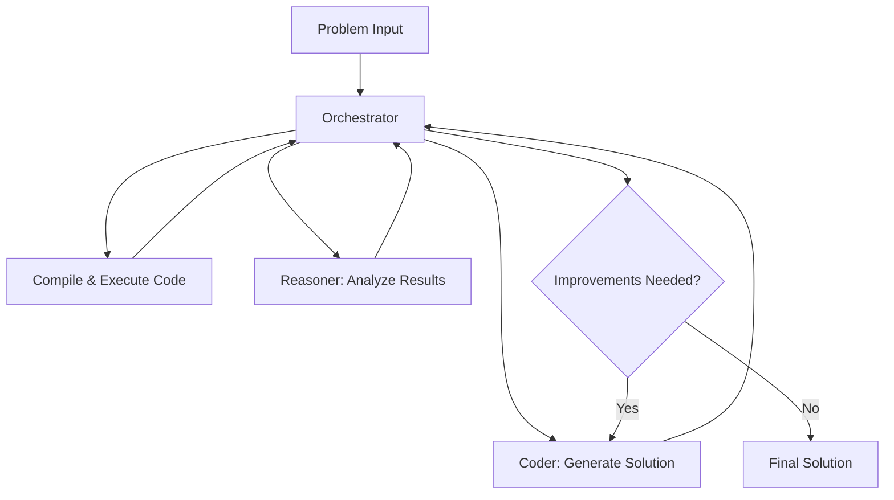

# LeetCode Solutions: An AI Evolution Experiment

This repository is a machine learning science experiment exploring how multi-agent AI systems and deterministic code checks can improve algorithmic problem-solving through iteration. Rather than showcasing individual coding skills, this project demonstrates the evolution of AI capabilities in solving complex programming challenges.

## The AI Evolution Approach

As AI increasingly demonstrates proficiency in solving coding tasks, the key differentiator becomes the ability to effectively orchestrate, tune, and maintain AI systems for real-world applications. This repository provides full transparency about AI's role while highlighting the human expertise required in system design, prompt engineering, and quality assurance.

## Multi-Agent System Architecture

Solutions are generated through a specialized three-agent system powered by world-class LLMs. This architecture emphasizes clear role boundaries and iterative improvement:

### 🎭 Core Agents

- **Orchestrator**
  - Manages workflow coordination
  - Facilitates inter-agent communication
  - Documents optimization journey
  - Maintains context across iterations
  - Powered by state-of-the-art LLMs

- **Coder**
  - Handles code generation
  - Implements optimizations
  - Maintains code quality
  - Ensures best practices
  - Uses advanced code-specialized models

- **Reasoner**
  - Analyzes solution approaches
  - Evaluates performance implications
  - Identifies optimization opportunities
  - Validates implementation choices
  - Leverages reasoning-optimized LLMs

### 🔄 Workflow Pattern

### 💡 Core Philosophy

The system operates on a "storyteller" pattern where the Orchestrator maintains the narrative of optimization without directly modifying code. It synthesizes insights from:
- Coder ↔ Reasoner iterations
- Compilation results
- Performance analysis
- Implementation choices

This approach ensures that each solution includes not just the "what" but also the crucial "why" behind implementation decisions.

## Solution Statistics

## Implementation

Powered by **OptiCodeGen** - my proprietary multi-agent API system deployed on **Railway** serverless infrastructure - this experiment demonstrates advanced AI orchestration at scale. The OptiCodeGen engine is the critical backbone that makes these automated solutions possible, featuring:

### Core Infrastructure
- **FastAPI** backend with high-performance async endpoints
- **Rust** integration for secure code compilation and execution
- **E2B Code Interpreter** as fallback sandbox for code testing
- **WebAssembly (WASM)** runtime for isolated code execution
- **Multi-agent orchestration** with specialized task-specific models

### Key Libraries & Technologies
- **Model Orchestration**: Pydantic V2 and Instructor for multi-model coordination
- **LLM Integration**: OpenAI, Google, and custom system prompting
- **Data Validation**: Structured type validation and schema enforcement
- **HTTP & API**: High-performance async endpoint management
- **Code Quality**: Automated formatting and linting pipelines
- **Reliability**: Robust error handling and retry mechanisms
- **Testing**: Comprehensive test coverage with async support

## Solutions

All solutions are available in the [`/solves`](./solves) directory, organized by problem number and automatically updated daily.

## Technical Details

### Solution Architecture
- **Problem Fetching:** LeetCode GraphQL API with smart caching
- **Solution Generation:** Multi-agent AI system via opticodegen
- **Quality Control:** Deterministic code validation and testing
- **Deployment:** Railway-hosted infrastructure
- **Automation:** GitHub Actions with intelligent scheduling
- **Monitoring:** Comprehensive metrics and notifications

### Solution Components
Each solution is automatically generated and includes:
- 🧠 AI model configuration and parameters
- ✅ Optimized, tested Python implementation
- 📝 Detailed approach and reasoning analysis
- 🔍 Time/space complexity breakdown
- 🏷️ Topic categorization and difficulty assessment
- 📊 Performance metrics and comparisons

## License

Shield: [![CC BY-NC-SA 4.0][cc-by-nc-sa-shield]][cc-by-nc-sa]

This work is licensed under a [Creative Commons Attribution-NonCommercial-ShareAlike 4.0 International License][cc-by-nc-sa].

[![CC BY-NC-SA 4.0][cc-by-nc-sa-image]][cc-by-nc-sa]

*Powered by OptiCodeGen - Proprietary Multi-Agent Code Intelligence System*

---
[cc-by-nc-sa]: http://creativecommons.org/licenses/by-nc-sa/4.0/
[cc-by-nc-sa-image]: https://licensebuttons.net/l/by-nc-sa/4.0/88x31.png
[cc-by-nc-sa-shield]: https://img.shields.io/badge/License-CC%20BY--NC--SA%204.0-lightgrey.svg
